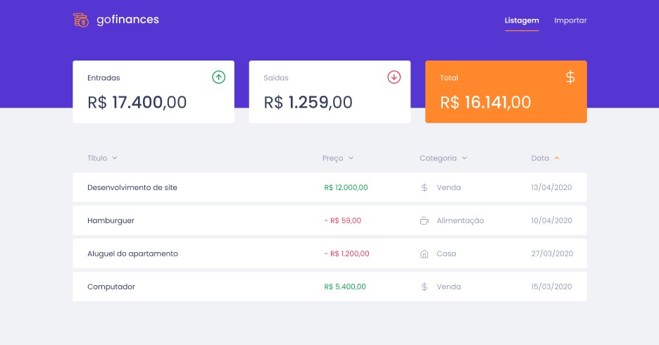

# 🚀 GoStack Challenge: GoFinances Web
This is a challenge of Rocketseat's GoStack bootcamp. It is a transaction management application, GoFinances. The application connects to the backend of the previous challenge (Database Upload), showing the transactions created and allowing the import of a CSV file to generate new records in the database.

## ⚙️ Technologies
- React
- TypeScript
- Axios
- Styled-components
- ESLint e Prettier

## 🤔 How to contribute

- Fork this repository;
- Create a branch with your changes: `git checkout -b my-feature`;
- Commit your changes: `git commit -m 'feat: my new feature'`;
- Push your branch: `git push origin my-feature`.

## 📜 License

> This project is under the MIT license. See the archive [LICENSE](https://github.com/jessicafpx/gostack-desafio-fundamentos-reactjs/blob/master/LICENSE.md) for more details.
---

##### 
 <strong> < desenvolvido por <a href="github.com/jessicafpx"> @jessicafpx</a> /></strong> 👋
